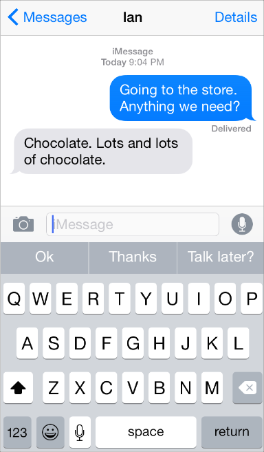
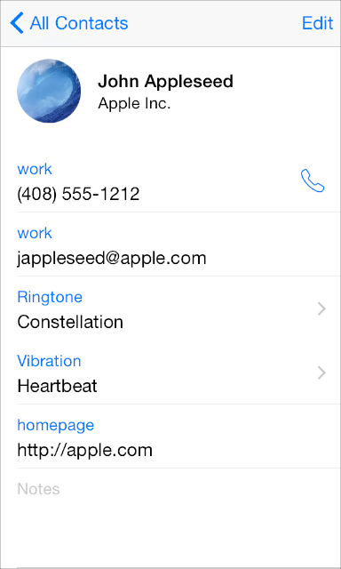
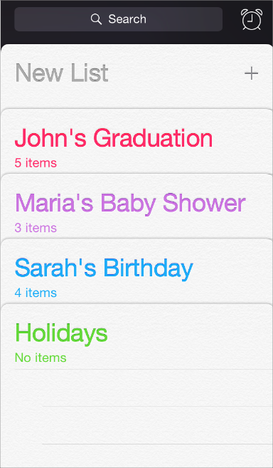
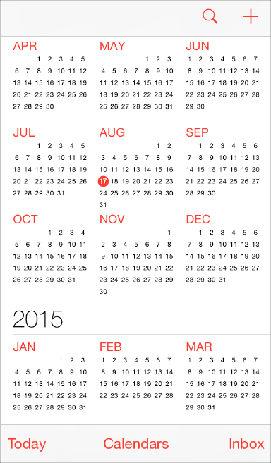
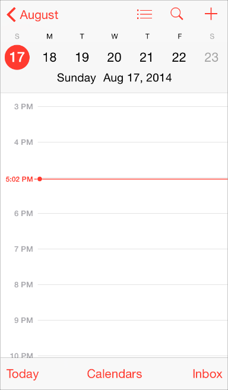

iOS 8 的视觉交互风格与 iOS 7 基本一致，一系列标识性的元素，如，扁平的界面元素，艳丽跳跃的色彩，纤细的线条，毛玻璃……   

好像自从 iOS7 发布后，「扁平化」风格就流行起来，甚至很多其他行业的人也知道了这个名词和趋势，而对产品团队而言，貌似不做出一个扁平化设计的产品都会被时代抛弃…      

其实扁平风格并非 Apple 专利，早在 iOS 之前微软 Windows 8 就开始大量使用扁平化界面元素表现其 Metro 视觉风格，同时 Android 4.0 之后也大量加入扁平元素，推出了一套极简设计风格 —— Holo ，所以 iOS 7 之前扁平化视觉风格就已然成为一股风潮。那为什么 Apple 要摒弃多年的拟物风格加入扁平风格阵营？或者说为什么各个大公司都不约而同的抛弃高光阴影选择了扁平视觉风格？     

原因很复杂也可以很简单——**一切删繁就简只为回归、专注于内容本身。**

在「 iOS 人机交互规范」当中强调了这几个概念：**依从 (Deference)，清晰 (Clarity)，深度 (Depth)。**

-----

#### 依从：依从内容

虽然漂亮的用户界面，流畅的动画效果都是 iOS 体验的一大亮点，但是用户关注的内容才是一个界面的核心。以下是几个方法帮助你依从用户的内容。

**利用全屏**。天气类 app 是该方法的最好示例：美观、全屏的当前天气位置的展示再加上为按小时划分的数据留出的空间，立即将最重要的信息传达出来。

**重新思考视觉提示元素的物理意义和现实意义。**面板，坡度，以及阴影有时会导致 UI 元素过重以致掩盖住界面主要信息或者与界面信息抢占视觉重心。取而代之地，应该关注内容并让 UI 处于一个服从支持的角色。

**用半透明界面元素暗示其后的内容。**半透明元素比如控制中心，提供一个情景，帮助用户看到更多可用的内容，且能够注意到瞬间变化。在 iOS 里，一个半透明元素只会让其后方直接遮挡的内容变模糊——给人一种透过毛玻璃在看的印象——不会让屏幕的其他部分变模糊。

----

#### 表达清晰

表达清晰是另一种确保内容在你的 app 当中至高无上的方式。这里有几种方式使你的内容显得最为重要且功能简洁易于交互。

**使用足够多的负空间。**负空间能让内容变得更加重要且功能更引人注意更易于理解。负空间也能传达一种镇定平静的感觉，也能使一个 app 更引人注意且高效。

**用色彩简化 UI。**一个主色——比如在记事簿里的黄色——高亮了重要的区域同时巧妙地暗示里其中的可交互性。也给一个 app 带来了一致的视觉主题。系统内建 app 运用了一系列纯净的系统配色，无论是深色还是浅色背景下每种颜色看起来都很不错。

**使用系统字体确保易读性。**iOS 系统字体自适应字间和行高，以便文本更易阅读，在每一种尺寸下看起来都很完美。无论你使用系统字体或者自定义字体，务必采用动态样式，从而你的 app 能够对用户选择的不同文本尺寸进行响应。

**使用无描边按钮。**默认情况下，所有的 bar 条按钮是无描边的。在内容区域，一个无描边按钮使用语境，颜色，以及一个触发动作的标题来暗示其可交互性。当按钮有意义时，内容区域的按钮能够显示细边或者带色的背景使其能被区分出来。

#### 使用深度进行交流

通常 iOS 在明显的层级展示内容以传达层级关系和位置，且能帮助用户理解屏幕上各主体元素的关系。 

通过使用半透明背景让层级看起来是浮在主屏之上，文件夹则使他们的内容从剩余屏幕里分离。

提醒在是在各层级里以列表的形式显示，如下所示。当用户在其中一个列表里操作时，其他的列表则会收起到屏幕下方。

当用户在年月日视图之间切换时，日历使用增强的过渡给予用户一种层级和纵深的感觉。此处展示的是滚动浏览年份的视图，用户能立即看到今天的日期并操作其他日历里的任务。

当用户选择一个月份时，年份视图缩小并显示月份视图。今天的日期依然高亮同时年份在返回按钮中显示，以便用户能明确他们现在正处于什么位置，他们是从哪个视图过来的以及怎么返回刚才的视图。

当用户选择一个日期时会出现一个相似的过渡：月份视图会分离到一边，当前的一周会推到屏幕上方且按小时来显示你选中的那天。在每一个过渡中，日历都在加强年、月、日之间的层级关系。

----

iOS 三大核心理念，如何更进一步解读？你需要重新理解并对 Deference，Clarity ，Depth 进行转义，转变成一种在设计工作中可以实践的方式。

你可以将 **Deference ** 理解为设计服务于内容，如何使设计服务于内容？从以下几个方面来实践：使设计简化、内容最大化、利用色彩、重视字体、利用负空间、区分图标状态。

**设计简洁。**你的界面需要专注于 app 的核心。设计的时候，每当你添加一个元素你都必须问自己：「这是必要的吗？」 除非你的 app 是游戏或者特定的主题，请尽量避免使用厚重的纹理，3D 效果以及多重阴影。取而代之地，你应该专注于有用的色彩，和谐的梯度，以及漂亮的字体。

**内容最大化。**内容应该占用全屏，把最大的空间留给内容要素。避免使用多重容器并将可滚动浏览区域最大化，这可以为交互留出更多空间。

**利用色彩。**一个可点击的元素要使用显著的色彩或者高亮。选择正确的颜色以及中性色调能成就你的设计也可以毁掉你的设计。

**字体就是内容。**为了用户界面的简洁以及对内容的专注，字体需要占据屏幕的 50% 到 90%。因此，选择一个漂亮的字体，设置字重、行高、颜色以实现视觉友好和最佳的阅读体验是至关重要的。

**利用负空间。**使用负空间能给想要表现的内容带来更多的专注和吸引力。你看到的越少，你立即能够投入的注意力就越多。负空间给你提供了更多的呼吸空间。不要用过多结构和不必要的视觉元素覆盖了你的屏幕。

**图标状态。**iOS 图标分为两种状态，轮廓和填充模式，轮廓是为了更少的分心。当图标被填充的时候，它会抓住你更多的注意力，也意味着当前这个页面处于激活状态。

**Clarity **就是使内容更明显一目了然。如何让设计中的内容一目了然？按钮易识别理解，字体有舒适的间距够明显且易读。内容应该清晰的表现出你的 app 的用途。使用明显易识别的图标，具有描述性的视图，让色彩富有意义。

**使你的文本更具可读性。**在 Retina 屏幕，字体应该最小应该不低于 22 px。阅读的最佳大小大约是 32 px。

Heading 通常在 50 - 100 px；

H2 大约在 30 - 50 px；

Body 大约在 26 - 40 px。

**使用明显易识别的图标。**图标的表意不能明确不清，而应该清楚的表达其象征意。只要有可能，就尽量使用文本+图标的形式来表达其含义。一旦你使用了一个图标就不要在另一个地方使用同一个图标或者该图标的变形，这会是你的用户感到迷惑。比如，不要使用一般概括性的文本比如「返回」或者「提交」，而应该用更精确的写法比如「返回主页」「注册一个新账号」。

**具有描述性的视图。**每一页都应该清楚的说明这一页是做什么的，屏幕上应该有一个清晰的标题或者一个高亮的tab bar 区域。

**让色彩富有意义。**色彩是有意义的，明智科学地使用红色、绿色、蓝色以及中性色调分别指示一些会有毁坏性操作，肯定操作，链接以及不可用状态。避免在不一样的意图下使用这些颜色来困惑你的用户，比如，不要在按钮上用绿色来表示「删除该页面」。

**Depth **是最难理解的部分，是一个非常抽象的概念，但同时也是最重要最特有的一部分。深度是指任何事物都是有语境的且有过渡的。在现实生活当中，当你从一间房走到另一间房，你会有一种处于连贯过程和距离变化的感觉。这样你就不会走失。这种概念也应该被运用在 app 当中。

**在设计实践当中运用界面过渡效果**，比如加入动效，这一点在 Xcode 5 当中有了比以往更多的支持和接口。

**使用毛玻璃背景。**保持背景 UI 处于情景之中，这一点不应该向保持内容清晰妥协。模糊背景不仅仅是让你保留其自然的颜色，同时也是把关注焦点带到前景最显著的位置上来。模糊不是一个新发明，那是在真实生活中已经存在的现象；当你的注意力集中再某件事上时，其他所有事物都会变得模糊。

**iOS  设计三大原则**

如果以上的要点你在设计中都不想顾及，那么以下几点在 iOS 当中你一定要遵照：考虑触控界面，使文本具可读性，为 iPhone 4 做优化。

**为点击而生：**按钮应该很容易被点到，在 Retina 屏幕上，按钮高度的尺寸应该再 60 - 120 px。最佳的高度是 88 px。再极少的情况下，文本内的链接设置为 44 px，但是要谨慎使用——这很难被点到。一个文本按钮可点区域甚至至少要 60 px。宽度不小于其高度。

**关注可读性：**在 Retina 屏幕上，字体不小于 22 px，阅读最佳尺寸大约是 32 px。使用的行高在 120 - 140% 间阅读体验更佳。

----

#### 最后

以上设计理念，算是 iOS 7 以后设计的核心特征，可作为 iOS APP 设计时的一个基础准则和参考，建议在设计时尽量遵照，以达到与系统趋于一致的感观和体验。但也不必每一条款都生搬硬套，还是要结合自身产品情况具体问题具体分析，可做适当的调整或取舍，但注重色彩、字体、负空间等事项，我想应该是做设计时万年不变的关键所在。添加动画、手势等属锦上添花的项目，可酌情考虑添加，量力而行。