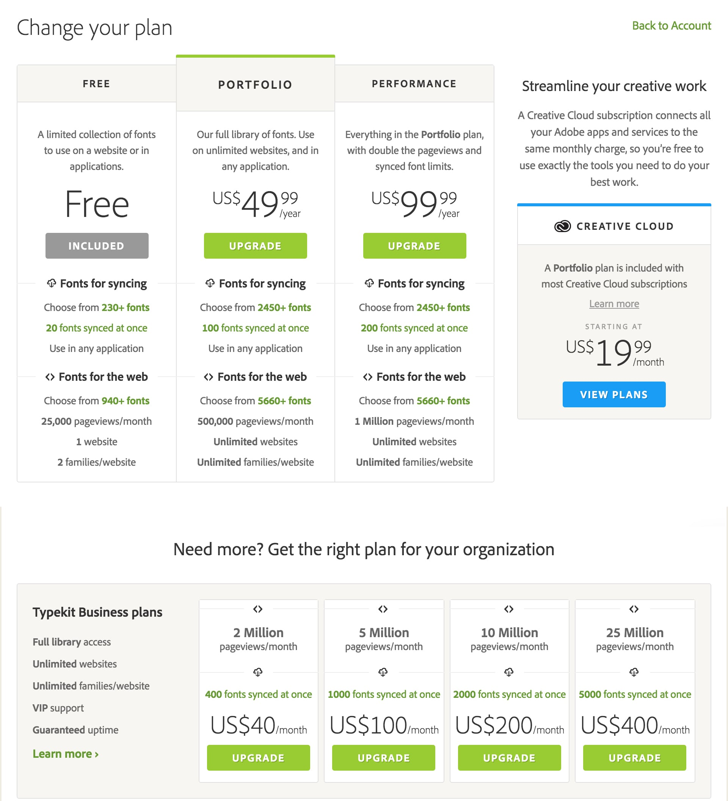

网页中使用字体（特别是中文）一向比较麻烦，尤其你是一个对字体非常挑剔的设计师，或者你设计的质感很大程度上是依赖字体的话。使用用户终端没有的字体，意味着你需要在远程服务器上放庞大的字体包（中文字体尤甚），这非常低效，加载几十 KB 的网页却要为了下载几 MB 至几十 MB 不等的字库等几十秒或几分钟，对用户来说这将是多么糟糕的体验，而做小项目或个人网站采用这种字体解决方案就更是没有必要得不偿失了。

于是一种常用解决方案是直接取不同用户终端的默认字体，在网页样式里设置一个字体优先级，这种做法能满足大多数网站的常规字体需求。

比如我常用的方案：

> `font-family: -apple-system,BlinkMacSystemFont,"Segoe UI",Roboto,Oxygen,Ubuntu,Cantarell,"Open Sans","Helvetica Neue","Helvetica",PingFang SC,PingFang TC,Hiragino Sans GB,STHeiti,Microsoft YaHei,Microsoft JhengHei,"WenQuanYi Micro Hei",sans-serif`

但是设计师通常不会满足于「常规」，你对网页字体风格、字重等都有极苛刻要求的话，中文的解决办法可以是将某字库中你所需要的汉字打包成一个比较小的字体包，随网页加载时一起呈现在用户终端。当然不谈中文英文字体的话，成本最低也最具可靠性的方案还是使用 Web Font 。

说到 Web Font，最近知名**开源免费**在线字体库 **Google Fonts** 迎来了更新，对 Google Fonts（https://fonts.google.com/）整站进行了 Material Design 化的重设计。通过网页设计上的优化，帮助用户更便捷地浏览和使用 Google Fonts。

_直接输入字符动态展示对应字体效果_

_推出了几款精美字体合集，更快找到想要的高质量字体_

侧栏 filter 可根据**字体类别、排序维度、语言、字体特征**来进行过滤，以便挑选到自己最想要的那一款字体。

进入字体页面，侧栏新增「相关信息」比如：**作者简介、字体简介、使用人数及地区分布、License** 等，于是实在不知道怎么判断字体优劣或选择困难症发作时，你可以选择大师作品、又或者「随大流」选择使用人数多的字体~

同时 Google Fonts 还会推荐一些适合与该字体搭配风格较为类似的其他字体。

当然，最显而易见地就是 VI 延续了 Material Design 的风格。

包括图标——无衬线大写 F + 淡淡长阴影 + 取自 MD 色板里的亮红色 ——可以，这很 MD！

另外，在中国大陆地区，网页里引用 Google Font APIs 时，理论上 https://fonts.googleapis.com 的 googleapis.com 是没有被 [ 哔—— ] 的，但实际上还是会有不稳定的情况出现，所以如果你的网页受众多在中国大陆地区，那么可以考虑一些国内字体 CDN，这样的资源你可以 Google 一下找到，这里就不再细说。

于是在此也对应推荐一个第三方的 Google Fonts Photoshop / Sketch 插件 **Fontea** （下载地址：[Fontea - Google fonts in Photoshop & Sketch, plugin by madebysource](https://fontea.madebysource.com/)），方便在工具内做图时使用。

另外，**Adobe Typekit** 也是一个很不错的字体订阅服务，可将字体同步至你的电脑或网站当中。

现在 Adobe Creative 系列里 Photoshop、Illustrator 等都自带 Typekit 字体同步功能。

同时你也可以用 Typekit 自带的 **Kits** 管理你的网站里所使用的字体。Typekit 不太一样的是其中的字体不是独立授权，而是订阅服务按时间周期收费，因此 Typekit 并非完全免费，目前主要 4 种定价策略 Plan。

如果想购买更多商业计算机字体（包括 Web Font），你还可以到蒙纳公司的 **[My Fonts](http://MyFonts.com)** 看看，其中有个工具叫「WhatTheFont」能读图识别字体还挺有趣~

再到中文字体的在线资源 **[justfont](http://www.justfont.com/)** 提供了丰富的在线中文字体资源，但不是完全免费。

然而最后回到现实，现有各种工具提供的网页上可用的中文字体解决方案其实都极其有限，也可以说中文字体资源本身还不够丰富，一大原因就是中文字体制作成本相当高，高质量字体更是只能由顶尖商业公司才有能力完成，于是精品字体数量不算多，授权费用也相当昂贵。所以目前很多对字体要求苛刻的设计师包括我自己在部分网页上会偏好使用西文字体。

最后说说我常用的免费 Web Font 仅供参考（除去各系统默认字体，开篇字体优先级里可参考）：Open Sans、Lato、PT Sans、Lobster、Rokkitt……当然还是那句话，适合的才是最好的。
