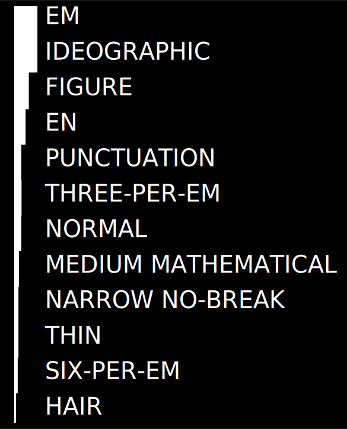

今天突然注意到一个问题 —— 空格符其实不只一种！

以往我总是会在意中英文间是否空格，标点符号与字符间是否空格的问题。   
其实标点符号与字符间（无论中西文）的空格问题并无定论，全球范围内的排版书写规范有好多……就不展开说了。  
总之，在我看来，在有争议的时候，*美观整洁才是最重要的*。

---

于是今天我看到 [Medium](https://medium.com) 在处理字符和 — （em dash）的时候，会在字符和 —（` &mdash; `）之间添加一个 `U+200A`。查了一下 `U+200A` 在 Unicode 里对应的字符为 *Hair Space*，也是占位最小的一种空格符。所以 Medium 这么玩也算是一种为了解决字符与 em dash 连接符间排版问题的 trick 了。

既然得知了 Hair Space，于是我就想了解一下空格的种类到底有多少种该怎么用。于是查了一下。

其实空格符并不是单指哪一种，而是 Unicode 里多种空格符类型的总称。大体上，空格符又分为两类—— **水平空格（Horizontal Space）** 和 **垂直空格（Vertical Space）**。

通常情况下我们的键盘 Space 键输入空格符为 **标点空格（Punctuation）**，占据一个西文字符的空间，多用来分割单词。对应的 Unicode 符为 `U+0020`，HTML 编码为 `&#32;` , ASCII 码对应 32 。

平时我们在键盘上用 Space 键和 Tab 键输入的空格符均为「水平空格」，而「垂直空格」最常见的表现形式则为我们按下 Enter 键时新建一行，即 line-break。

目前在 Unicode 里被设置为「空格」即，"WSpace=Y", "WS" 的字符有  **25**  个；**17** 个字符使用了「双向书写」（bidirectional writing）算法里的空格定义，即 "Bidirectional Character Type=WS", 也称为 *Bidi-WS 字符*，还有 **6** 种字符没有 "WSpace=Y" 属性，以及另外 **5** 种「可见的」空格符替代符。    
[详情参阅表格](https://en.wikipedia.org/wiki/Whitespace_character#Unicode)

### 常见的水平空格符有如下几种：

> * Em
> * Ideographic
> * Figure
> * En
> * Punctuation
> * Three-Per-Em
> * Normal
> * Medium Mathematical
> * Narrow No-Break
> * Thin
> * Six-Per-Em
> * Hair

共 12 种，以下为它们所占的宽度对比：

### 字体排印里空格宽度多大才合适
当然空格符宽度并不是一定的，它是一个变量。
在字体设计中，通常一个字符的空格是 1/5 em 到 1/3 em，具体取哪个值，视字体字型（包括是否为粗体、斜体）而定。

### Breaking Space 和 Non-breaking Space
通常我们的计算机程序里都会支持「自动换行」（word wrap），根据窗口宽度在满行后自动换行，而这个换行是在空格位置上进行。所以通常我们输入的空格为 Breaking Space 支持自动换行功能。于是相对地，Non-breaking Space 即是为了避免自动换行而产生，Unicode 编码为 `U+00A0`, HTML 中为 `&nbsp;`。 于是引入一个概念——「硬空格」（Hard Space），通常指 Non-breaking Space、Non-expading
 Space 或 Non-combing Space 一类的字符，避免空格处自动换行或者合并多个空格，与之相对的概念「软空格」（Soft Space）。

---

### 结论

于是 回到本文开头，我在 Medium 里的发现。为了避免 en dashes 与前后词之间间距太小，在排版时通常会在 en dash 和字符间加一个 **Hair Space**（Unicode: `U+200A`, HTML: `&#8202` 或 `&hairsp;`）或者 **Thin Space**（Unide: `U+2009`, HTML: `&#x2009;` 或 `&#8201;` 或 `&thinsp;` 最后这种命名可能会有浏览器不支持）。
