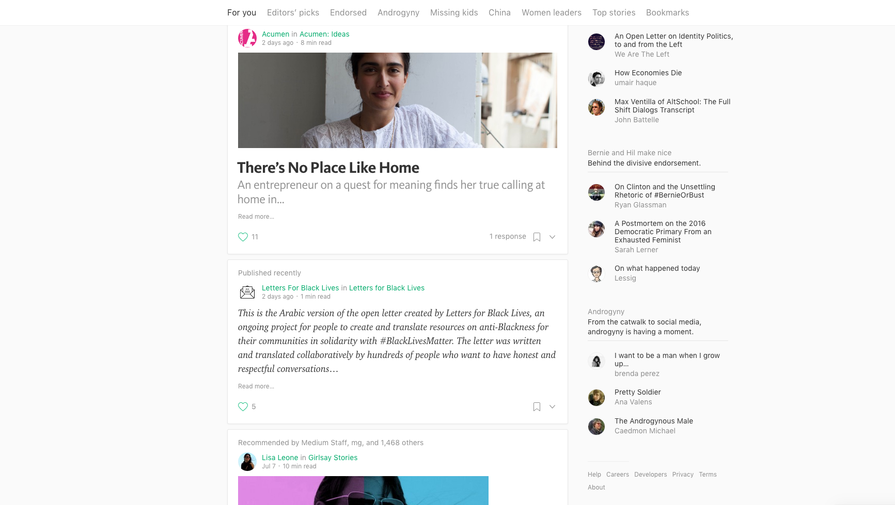
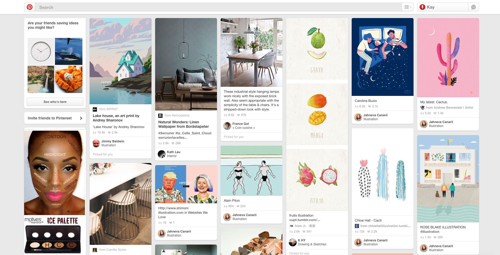
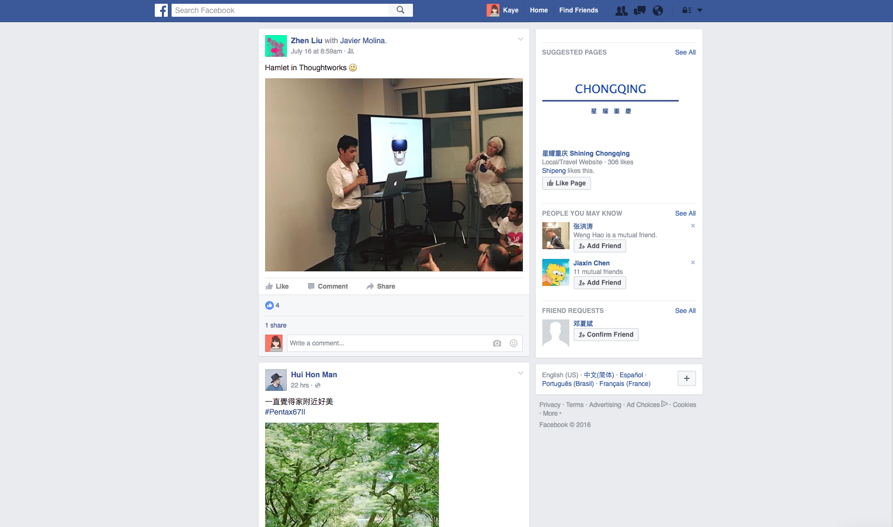
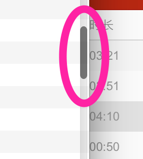
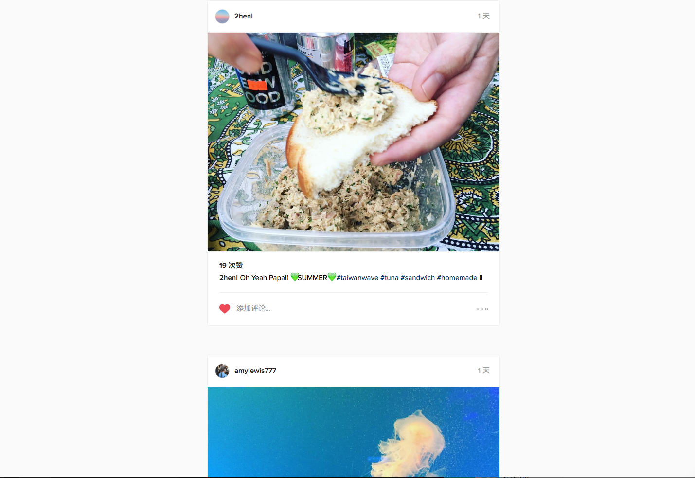
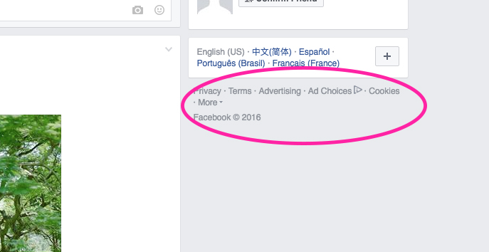
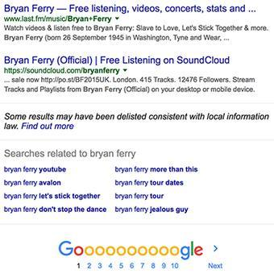

之前在 Review 别人的原型图时有为这个问题思考过。
因为当时我下意识地觉得在「控制台」这种地方使用「自动加载」（无限滚动）直觉上好奇怪，为什么不用分页？于是我开始反思这两种交互方式的适用场景。

----

先说我个人思考后得出的结论（下划线部分为主要结论）：
**<u>肯定没有哪种方案是绝对的「体验最好」的，分页和无限滚动浏览的选择均是视场景而定，且各有优劣势。</u>**（这也几乎是任何交互方案选择时的通用回答吧）

**<u>无限滚动自动分页加载</u>**（即，一页数据拉到底后会自动加载出下一页数据）适用的场景

**1）<u>发现内容，需要快速激发用户积极性时</u>**  

此场景的特点是：

- 需要让用户在短时间里找到&浏览自己喜欢的合适的条目，更多感兴趣的条目
- 内容间逻辑上的先后顺序并不重要
- 单条内容与全部内容间并无有意义的逻辑关系

所以结合以上特点，无限滚动被广泛使用于内容型社区的 Feed 或发现页当中，比如，知乎、Medium 首页、Pinterest……

**2）<u>信息流条目更新速度快，且用户不需要逐条浏时 </u>**      
同样，在这样的场景里，条目之间并没有太大的依赖关系，用户在每一页都是一晃而过，并不会逐条逐句浏览，漏掉一条信息并不会对用户造成负面影响。

所以很多社交网站的 Feed，如 Facebook、Twitter、微博……均选用了无限滚动自动加载的方式供用户获取数据浏览。

另外选用「无限滚动自动加载」还有很多**优势**：      

**1)**  滚动操作或在移动端上的滑动手势，相比点击 **<u>操作成本更低，用户心理会更加轻松</u>**

- 点击操作的体验过程：看完一页，点击，然后等待加载 —— 对等待会有预期也有明显感知（焦虑或负担）
- 滑动操作的体验过程：一边浏览一边滚动一边加载——对等待无预期无明显感知（轻松随意）

于是在「自动加载」时切忌让用户明显感知到加载过程，完全感知不到是最好

**2) <u>对移动设备友好</u>**

- 移动端屏幕小，并不适合放太多功能按钮用作点击
- 滚动拉取更多信息手势简单，更加符合直觉

----

同时「无限滚动自动加载」也有其**缺陷**：

**1) <u>难以定位和检索</u>**

- 浏览到信息流中部，由于有其他事中断了浏览，或者关闭了窗口，过一段时间重新访问页面浏览（数据整个刷新了），我无法从位置来找到上一次所浏览的条目了，也很难通过位置的记忆来找到之前有印象的某个条目。
- 很难快速找到历史第一条内容或比较旧于是排序很后的内容。

**2) <u>滚动条碍事，视觉上遮挡和失衡</u>**

- 虽然通常滚动条都是会在停止滚动时自动隐藏，但在小屏幕或小窗口里一直不断滑动浏览内容时，滚动条的存在感还是会显得很强烈。

- 其实滚动条该不该要为什么需要这一点以前也跟朋友讨论过。我自己的思考是：滚动条用于表现当前位置与总的内容长度之间的数量和位置关系。而无限滚动自动加载时，你处于正在加载的状态，意味着内容总长度是未知的，或者滚动条表达的内容总长度并不等于真正的历史内容总长度，所以滚动条位置只能表达一个「相对位置」而不是「绝对位置」。因此并不能正确展示当前位置与内容总长度之间的关系，我觉得在无限滚动时出现意义不大。于是还会衍生出第 (1) 个问题——难以定位。

- 而从直觉上我觉得滚动条表现出的「相对位置」依然能给人一种临时的对数据量和浏览进度「控制感」。

**3) <u>可能永远看不到 Footer</u>**

- 页面滚动到底时本该看到 Footer ，然后自动加载又刷出了新的一屏内容，Footer 成功被瞬间挤走。比如 Instagram 的首页。

- 这种时候你需要权衡，Footer 的信息是否需要在首页被看到，或者思考还有没有别的地方可以让用户访问到 Footer 的信息。于是可以像知乎和 Facebook 那样把 Footer 放在侧栏：

----

于是相应地，**分页**就可以用于弥补无限滚动自动加载的缺陷，于是也就成了**分页的优势**：

**1) <u>方便检索、定位</u>**

- 能快速到达首页末页等内容的任一位置

**2) <u>给人控制感</u>**

- 能获取到自己当前浏览的内容的绝对位置
- 对接下来即将出现的内容量有预期

**分页适用的场景：**

**1) <u>需要对数据逐页或逐条处理的地方</u>**

- 有分页时，每页数据仅 10 条左右，能让人更专注地阅读或处理当前页内容。比如处理邮件、读书分页看……

**2) <u>产品需要展示数据量，用户需要对数据总量快速感知的时候</u>**

- 不必展开所有条目，仅通过页码就能感知到数据总量大小，比如搜索结果展示…

----

因此回到最开头，我曾经直觉「控制台」用「无限滚动自动加载」很奇怪，也就找到可以名状的缘由了。管理后台控制台这类场景需要用户对数据进行操作管理，需要对内容全局有很强的控制感，同时也兼有快速定位查找的需求，所以「分页」才是更适合该场景的选择。

----

现在也有一些网站取无限滚动自动加载和分页各自优点结合使用。
比如，（找到图了再补上）
内容区域使用自动加载无限滚动，让内容拉取更加轻松自然。但每次自动加载出来的内容会有区块分割并标上序号，同时在 url 里添加页码字段，方便用户通过修改 url 快速定位。但这样做有点把实现模式强加到用户的认知行为模式之嫌，不够友好。我认为可以将修改 url 的方式通过用户界面的操作实现，让用户更容易理解。

----

最后总结一下结论：

**1）按照 Web 和 App 来比较，无限滚动是对移动端天生友好。**

**2) 如果按产品定位或者场景来谈**

- 无限滚动更适合用于 Timeline 快速浏览内容和发现内容的场景，所以社交或内容型社区的 Feed 通常都选择无限滚动；
- 分页更适合于操作、管理大量条目，且更需要专注、严谨的场景，所以工具类、检索类、归档页面，管理后台更倾向于用分页。
- 总体而言，移动端更适合于使用滚动手势进行浏览。

P. S：交互设计主要专注于封装并隐藏实现模式用符合用户认知模式的方式引导用户与界面交互从而完成任务、达成目标。而本篇讨论的「分页」和「无限滚动」从实现上看，无论在移动端还是 PC 端，无论选无限滚动还是分页的交互形态，数据层都是「分页」来获取数据，所以对后端来说这两者展示形式的实现没差别。
