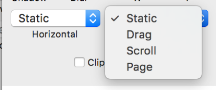

## 滚动

一个视图的水平和垂直方向滚动可以通过设置组（Group）的滚动属性达成

Principle 可分别对水平和垂直方向的滚动状态进行设置，共有：**静态（Static）、滚动（Scroll）、分页（Page）、拖拽（Drag）**四种类型。

值得注意的是，要想视图能够正常滚动，一定要正确设置滚动区域。

比如你想让一条长长的 Feed 在 iPhone 6 屏幕，即 375*667 的可视区域内垂直方向滚动，那么可滚动的 Feed **内容图层组**（Group）的长（H）宽（W）属性一定要跟展示可滚动**内容的容器**长宽一致，而不能让长宽跟内容的实际长宽一致，否则会出现「滚不动」的现象。

总之，在设置属性时，要特别注意图层和组以及组之间父级子级的关系。
