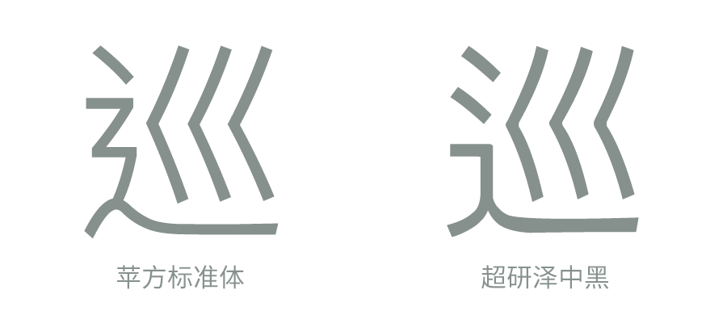
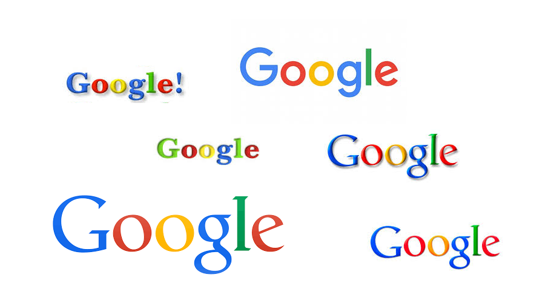
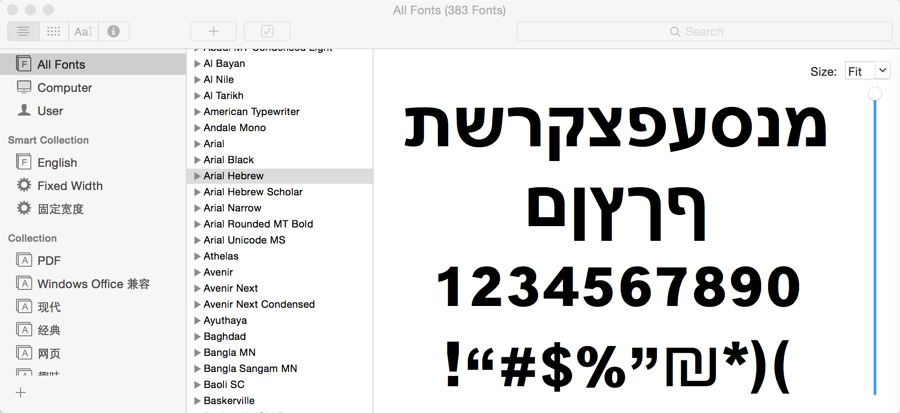
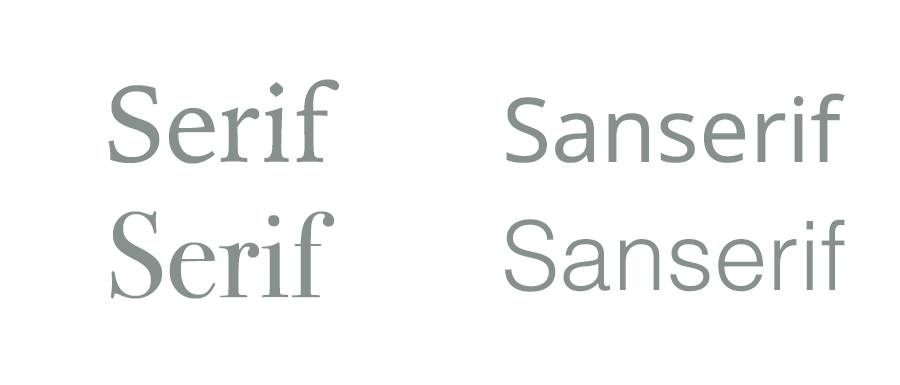
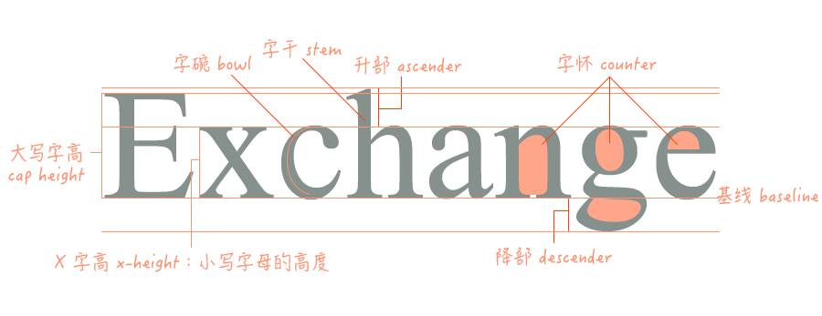

向心仪的人表白时，你可以说：" I think you are more perfect than Helvetica." 当然，前提是对方得知道 Helvetica 在字体界的分量——一款基本上用了不会出错的西文字体，可见其适用范围之广，堪称完美。

\--------

以上说法其实略微有些夸张了，因为严格说没什么字体可以说完美，没有最好的字体只有最适合你需求的字体。

---

为什么要介绍字体（主要是一些字体常识）？因为实用！

正好在工作和生活中，我是越来越深刻地感受到，小到写一条微博、Tweet，大到写一份邮件甚至公文，字体的使用能很好的反映出一个人一个团队的基本素养和专业态度。所以掌握字体常识，做到书写规范，真能为你加分不少！

**你需要知道的一些字体名词**

下面介绍一些关于字体的名词也就是基本术语啦。目的很简单：让你快速建立对字体的基本认识，同时也便于你在今后的扩展阅读或者工作中偶然遇到类似话题不至于一头雾水。

**字形**：好似一个字的骨架，字形展现了一个字的特征性，如笔画方向和笔画位置等。比如同一个汉字，分别书写成繁体和简体就可以说是字形不同了；又比如说对于同一个简体字，以旧字形书写和以现代字形书写，你也可以说他们的字形不同。

_不同字形的「巡」_

**字体 (typeface) **：好似字骨架上的肌肉，同一副骨架上可以有不同的肌肉线条，所以同一种字形可以有多种字体。这也是生活工作中最常用到的一个「字体」概念。

比如，

> 那个 logo 的字体改一下啊，要炫一点，让客户眼前一亮的！

_不同字体的 Google_

以上场景所描述的也就是「字体设计」所说的「字体」概念啦。

换一个场景，

> 大神帮我越狱一下啦，我想要给手机换一个可爱的字体呢。

其实这里所讲到的「字体」就更接近于「字库」的涵义。

**字库**：也就是各位在计算机当中常见的 Font，现代多指计算机上的数码字体，也就是你安装在计算机上的字体软件啦，诸如，华文字库，方正字库，汉仪字库……

> 包含字偶间距调整信息，并且能在电脑上运行的粗细统一的数码字体就称为一个「字库」，或者说是「字体软件」
> —《西文字体》

还需要指出的是，一套完整字库不仅包含相应的西文或中文字体，还应提供数字标点特殊符号等字符的设计。也就是说平时选择字库时，你需要注意该字库特殊字符与文字间的设计搭配是否协调，并可以此作为一个评价依据，帮助你找到一款最适合你的字体。

_6.26 更新：字型和字体概念_

对于这两个概念的中文表述对应的涵义是有争议的，或者说不同的人有不同的理解，所以在此更新一种我认为更为「正统」的理解。

字型 (typeface) ，其含义实质更像是日常交流中大家所说的「字体」的涵义，例如：华文黑体、中易宋体、汉仪旗黑这是三个 typeface 也可以说是三个 font family。

而「300 字重 15 号的中易宋体」这样的描述才可以称为一个「字体」。所以这里「字体」应该被理解为包含有具体属性参数的某一个 typeface 。

---

下面再说一组平时常出现在网络上以及你的个人电脑上的名词：衬线 (Serif) 字体 & 无衬线 (Sanserif) 字体 。

**衬线 (Serif) 字体：**又被称为罗马正体，因追溯其起源是来自于古罗马时期所形成的大写字母样式。什么个样式呢？也就是笔画的末端带有弧度的「爪」或带平直线条（衬线）的字体。
Serif 适用于印刷排版时的正文字体，有助于读者水平方向视线移动，不会增加眼睛负担。所以各位的课本正文印刷多使用衬线字体（宋体之类）。

**无衬线 (Sanserif) 字体：**Sans 即法文中「无」的意思。顾名思义，也就是笔画末端没有爪状或者平直线条（衬线）的字体。
Sanserif 字形简洁，常用于标题或户外指示牌，而今在数码设备上，由于屏幕 ppi 的局限，精度远不及印刷，无衬线字体平直简洁的笔画显示效果更佳，而大受追捧。

再说一组各位经常在编辑器里或 HTML 标签里见到的名词：**Italic（意大利斜体） & Oblique（单斜体）**。

你一定想问，不都是斜体吗，有什么区别？

**意大利斜体 Italic**：原本是意大利使用的一种手写体，而现在在各个字库或者书写排版当中，你可以看到 Italic 多是与正文字体搭配使用的「倾斜字体」。

**单斜体 Oblique**：追溯至活字时代，人们为了区别于意大利手写风格的斜体，而单纯将罗马字体进行倾斜处理而形成的字体。

简单地说，Oblique 是简单粗暴的！只需将罗马正体字单纯的做倾斜就可以得到。

而 Italic 的制作则考究很多，因为单纯将一个字做倾斜处理，笔画间的负空间会变化而失去了原有的协调，给人以笔画被推倒了、拉散了的视觉效果。所以制作 Italic 字体时，会重新设计笔画，以求得正负空间在字体倾斜后的协调。因此现在多推崇使用专用的斜体—— 意大利斜体 (Italic)。

### 一幅图了解字体设计术语

每次网络上大家热议「如何评价 OS X 新字体」「如何评价谷歌新 logo」…… 时，你是不是总会被各位网友或者业界专家提及的字体设计术语弄得晕头转向，别人似乎「评价」得超细致了，但因为不知道相关术语的涵义，你还是不明白人家究竟在说些什么。

_好，请看下图，大部分常用的词都在里面~_

而这些 points 也正是标记出一款字体的设计特征的关键点。

### 日常书写建议

对字体有了基本认识后，怎么运用于日常文稿书写制作当中？规范书写提升内容的可读性才是最重要的！

下面是几点建议：

► **字体数量不可选用过多。**

通常标题选用一种字体，正文选用一种字体，注释选用一种字体就差不多啦。再省事一点，通篇使用一种字体也没问题！记住「如无必要，勿增实体」就对了。

**► 中英文标点不要混淆使用。**

标点混用这一点其实多半是由于日常书写规范意识不强外加粗心手抖所致，会给观者一种不专业不认真的印象。反倒是在写代码时，编译器对于中英文字符的混用几乎是零容忍度。所以日常书写时也请用编译器般的苛刻眼光来审视自己的文稿。

**► 标点符号正确使用。**

这个是在曾经的语文课上老师就有教的~

**► 正确使用「空格」。**

尤其是中英文混排时，中文字符和英文字母间以及中文和数字间应使用一个英文空格将其隔开。如，我们的研究所叫作 WorkShed ，诞生于 2015 年。

英文书写时，英文标点后需要使用一个英文空格。如" Hello, World. "

其实现在很多体验比较优秀的编辑器或排版系统已经可以做到自动添加合适的字间距 space 了。但不排除仍有很多编辑器还处于手动添加的阶段，需要自查。

_补充：_

其实正规的排版里不鼓励中西文字符间添加英文空格，添加英文空格这仅是在大量排版系统或编辑器功能不完善时期的一个 fallback 对策。

从排版上说，是希望中西文有间距而不是空格符，该间距为 1/5 em 到 1/3 em 较合适。

**► 注意几个特殊标点的使用。**

**直角引号「」和弯引号 “”**

按理讲，汉字作为方块字，直角引号与汉字搭配更为「合适」。在中文正体字的出版物里，你也可以看到直角引号被广泛使用。而在简化字环境下，使用哪一种引号，就看你个人的审美判断以及价值判断了。而我选，我还是会选择更加适合汉字的直角引号。

**连字符和连接号的区分**

连字符是 - ，直接按数字键旁的减号就可以输出。多用于英文书写时，行末长单词的换行连接。从表意的角度上看，使用连字符多半是为了连接一个整体里的两个部分，因此人名和地名里也常使用连字符。需要注意的是行末的连字符设置的位置需要考虑最末单词的涵义和构词，比如行末 equipment 需要用连字符连接，则写作 equip-\<br\>ment ， 而不能是 equi- \<br\>pment。

而连接号多半是被大家忽略的一个符号，于是该用连接号的地方，都错用了连字符。表意上，连接号与连字符不同，表示起始关系的链接和两个并列关系的属性的连接。比如表示时间、地点或页码的连接，从…到…，就该使用短连接号 – (option+ -)。如，1998–1999, New York City–Boston, Page 1–5…；又如，表并列关系连接人名 Brown–Smith 代表这是两个人并列，如果是连字符 Brown-Smith 则代表一个人名 ， 所以如果连接号与连字符混用很可能在表意上产生歧义。

## **字体推荐（其实就是我比较爱用到的）**

首先有个建议，用于数码设备时优先选用简洁的无衬线字体，在屏幕上的可读性更强。当然有特别需求时，比如要表现古朴风韵或向传统致意时则不妨大胆选用适当的衬线字体。

其实目前可用的中文字体还很匮乏，好的选项差不多就那几家的咯。

**还不错的中文字体：**
其实你可以就省事选择操作系统默认的中文字体，因为那正是顶尖设计师替你挑选好的一个还不错的选项。

比如 OS X 里的冬青黑体、华文黑体、Heiti SC，随 EI Capitan 推出的苹方字体。

以及几款基本不会出错且可用性强的中文字体：汉仪旗黑，思源黑体，信黑，方正兰亭黑……
做 Web 设计时如果要问适应 Windows 时该用什么字体，那只能说微软正黑或者雅黑了。（摊手）

另外，在同质化明显的屏幕字体编排当中，其实大胆使用明朝字体反而让人眼前一亮，更具汉字的历史感和书法的韵味，个人认为在屏幕上的可读性可用性远比各家楷书强。

**西文字体：**可谓百花齐放，选择真的很多。
文章开头提到的 Helvetica 及其改良版 Helvetica Neue 算一个经典。
Noto Sans 所给的英文字体也还不错。
以及 Android 默认字体 Roboto，iOS 9 默认字体 San Francisco。
Google 2015 年最新视觉识别系统所使用的几何无衬线字体 Product Sans。

带有古韵的经典字体：
Galliard, Garamound, Caslon, Akzidenz Grotesk, Trajan……

极具现代感的无衬线字体：
Gill Sans、Futura、Avenir、Eurostile……

## 文末相关推荐

[https://www.fontshop.com/](http://link.zhihu.com/?target=https%3A//www.fontshop.com/)

[https://typekit.com/](http://link.zhihu.com/?target=https%3A//typekit.com/)

[MyFonts: Fonts for Print, Products & Screens](http://link.zhihu.com/?target=https%3A//www.myfonts.com/)

Modern typography: an essay in critical history – Robin Kinross
西文字体 – 小林章

Type Spaces: Typography in a Three-Dimensional Space
